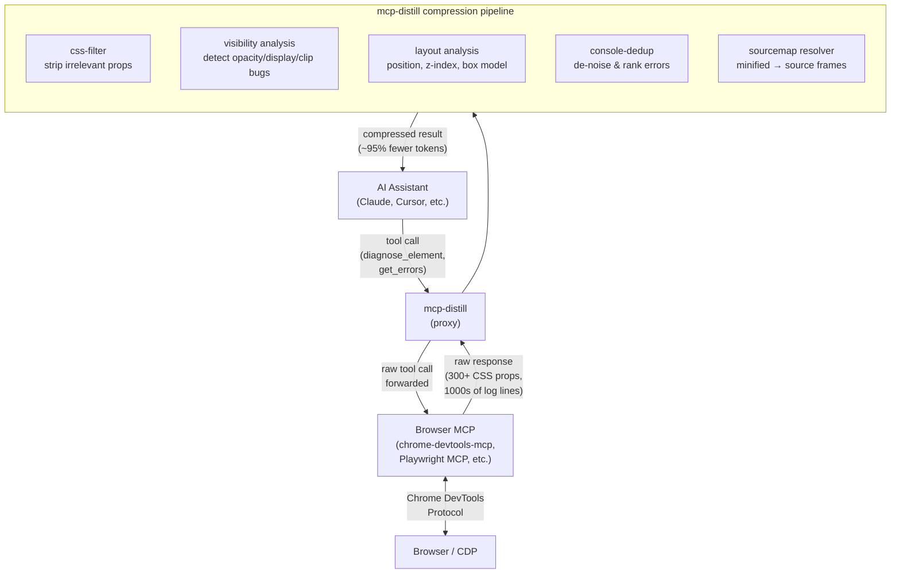

# mcp-distill

Context compression proxy for browser DevTools MCP servers. Sits between your AI coding assistant and any browser MCP (chrome-devtools-mcp, Playwright MCP, etc.) and turns raw browser output into actionable diagnostics.

A single computed-style call returns 300+ CSS properties. A console dump from a React app is often thousands of duplicate warnings. mcp-distill filters that down to what actually matters: the AI gets a focused 300-token answer instead of a 15,000-token dump.

---

## How it works



---

## Token reduction

| Scenario | Raw output | mcp-distill output | Reduction |
|----------|-----------|-----------------|-----------|
| `diagnose_element` on a `body` element | ~6,000 tokens | ~300 tokens | 95% |
| `get_errors` on a React app with console noise | ~4,000 tokens | ~200 tokens | 95% |

---

## Install

```bash
npm install -g mcp-distill
# or run without installing:
npx mcp-distill
```

Requires Node.js 20+.

---

## Setup

mcp-distill proxies requests through your existing browser MCP. Configure both in your AI assistant's MCP settings.

**Claude Code**: add to `~/.claude.json` under `mcpServers`:

```json
{
  "mcpServers": {
    "mcp-distill": {
      "command": "npx",
      "args": ["mcp-distill"],
      "env": {
        "MCP_DISTILL_BACKEND_CMD": "npx",
        "MCP_DISTILL_BACKEND_ARGS": "chrome-devtools-mcp"
      }
    }
  }
}
```

**Cursor**: same config, placed in `~/.cursor/mcp.json`.

Replace `chrome-devtools-mcp` with whatever browser MCP you already use (`playwright-mcp`, `firefox-devtools-mcp`, etc.).

---

## Tools

### `diagnose_element`

Fetches computed styles for one or more CSS selectors, runs heuristic analysis, and returns a compressed report identifying likely visual bugs. When a selector matches nothing, the same call returns up to 5 closest-match suggestions (no second round-trip needed).

Parameters:
- `selector` (string | string[]): CSS selector or array of selectors (max 20). e.g. `"#submit-button"` or `["#header", "#main", ".footer"]`
- `include_box_model` (boolean, default: `true`): include margin/padding/border in output

Example output (single selector):
```json
{
  "summary": "#submit-button: opacity:0 (likely cause)",
  "details": {
    "selector": "#submit-button",
    "issues": [
      { "type": "invisible", "property": "opacity", "value": "0", "severity": "high" }
    ],
    "styles": {
      "display": "inline-flex",
      "opacity": "0",
      "visibility": "visible",
      "position": "relative"
    }
  }
}
```

Example output (batch, with a typo selector triggering suggestions):
```json
{
  "summary": "3 elements diagnosed, 1 with issues, 1 not found. Top: #submit-btn opacity:0",
  "details": {
    "results": [
      { "selector": "#submit-btn", "issues": [...], "styles": {...} },
      { "selector": ".card", "issues": [], "styles": {...} },
      { "selector": "#submt-btn", "not_found": true, "suggestions": ["#submit-btn"] }
    ]
  }
}
```

Detects: `opacity:0`, `display:none`, `visibility:hidden`, `clip-path` clipping, zero-size with `overflow:hidden`, `pointer-events:none`, unanchored absolute positioning, `z-index` on static elements.

---

### `get_errors`

Fetches console logs, deduplicates them, strips React/webpack noise, and returns a ranked list of real issues. Minified stack frames are resolved through source maps where available, so `app.min.js:1:54321` becomes `src/components/ProductList.jsx:42`.

Parameters:
- `severity`: `"error"` | `"warning"` | `"all"` (default: `"error"`)
- `limit` (number, default: `20`): max unique issues to return
- `resolve_sourcemaps` (boolean, default: `true`): fetch `.map` files and resolve minified frames. Set `false` to skip outbound requests.

Example output:
```json
{
  "summary": "3 unique issues (from 847 total log entries). Top: TypeError: Cannot read properties of undefined",
  "details": {
    "total_log_entries": 847,
    "_sourcemap_resolved": 2,
    "unique_issues": [
      {
        "level": "error",
        "message": "TypeError: Cannot read properties of undefined (reading 'map')",
        "count": 312,
        "source": "app.js",
        "stackTrace": ["at fetchItems (src/components/ProductList.jsx:42:18)"]
      }
    ]
  }
}
```

Filtered out: React key warnings, HMR messages, DevTools download prompts, deprecation notices. Sourcemap resolution falls back silently to the raw frame on any fetch or parse failure.

---

## Error handling

If mcp-distill can't parse a backend response, it returns the raw data alongside a `_lens_warning` field explaining what failed. The AI always gets the data, never less than it would have without mcp-distill in the path.