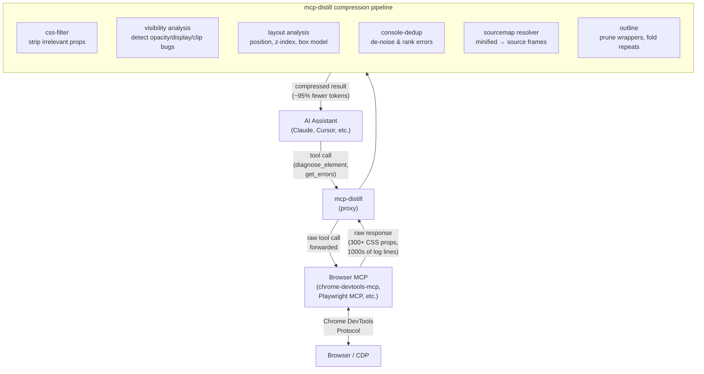

# mcp-distill

Context compression proxy for browser DevTools MCP servers. Sits between your AI coding assistant and any browser MCP (chrome-devtools-mcp, Playwright MCP, etc.) and turns raw browser output into actionable diagnostics.

A single computed-style call returns 300+ CSS properties. A console dump from a React app is often thousands of duplicate warnings. mcp-distill filters that down to what actually matters: the AI gets a focused 300-token answer instead of a 15,000-token dump.

---

## How it works


```mermaid
flowchart TD
    AI["AI Assistant\n(Claude, Cursor, etc.)"]
    LENS["mcp-distill\n(proxy)"]
    BACKEND["Browser MCP\n(chrome-devtools-mcp,\nPlaywright MCP, etc.)"]
    BROWSER["Browser / CDP"]

    AI -->|"tool call\n(diagnose_element,\nget_errors)"| LENS
    LENS -->|"raw tool call\nforwarded"| BACKEND
    BACKEND -->|"raw response\n(300+ CSS props,\n1000s of log lines)"| LENS
    BACKEND <-->|"Chrome DevTools\nProtocol"| BROWSER

    subgraph compression ["mcp-distill compression pipeline"]
        direction TB
        CF["css-filter\nstrip irrelevant props"]
        VIS["visibility analysis\ndetect opacity/display/clip bugs"]
        LAY["layout analysis\nposition, z-index, box model"]
        DEDUP["console-dedup\nde-noise & rank errors"]
        SM["sourcemap resolver\nminified → source frames"]
        OUT["outline\nprune wrappers, fold repeats"]
    end

    LENS --> compression
    compression -->|"compressed result\n(~95% fewer tokens)"| AI
```

---

## Token reduction

| Scenario | Raw output | mcp-distill output | Reduction |
|----------|-----------|-----------------|-----------|
| `diagnose_element` on a `body` element | ~6,000 tokens | ~300 tokens | 95% |
| `get_errors` on a React app with console noise | ~4,000 tokens | ~200 tokens | 95% |
| `get_page_outline` on a 100-item product listing | ~6,200 tokens | ~230 tokens | 96% |

---

## Install

```bash
npm install -g mcp-distill
# or run without installing:
npx mcp-distill
```

Requires Node.js 20+.

---

## Setup

mcp-distill proxies requests through your existing browser MCP. Configure both in your AI assistant's MCP settings.

**Claude Code**: add to `~/.claude.json` under `mcpServers`:

```json
{
  "mcpServers": {
    "mcp-distill": {
      "command": "npx",
      "args": ["mcp-distill"],
      "env": {
        "MCP_DISTILL_BACKEND_CMD": "npx",
        "MCP_DISTILL_BACKEND_ARGS": "chrome-devtools-mcp"
      }
    }
  }
}
```

**Cursor**: same config, placed in `~/.cursor/mcp.json`.

Replace `chrome-devtools-mcp` with whatever browser MCP you already use (`playwright-mcp`, `firefox-devtools-mcp`, etc.).

---

## Tools

### `diagnose_element`

Fetches computed styles for one or more CSS selectors, runs heuristic analysis, and returns a compressed report identifying likely visual bugs. When a selector matches nothing, the same call returns up to 5 closest-match suggestions (no second round-trip needed).

The backend's script evaluation tool is discovered at runtime (`evaluate_script`, `browser_evaluate`, or any tool matching `/evaluate|eval_js|execute_script/`), so the same diagnosis works across browser MCPs.

Parameters:
- `selector` (string | string[]): CSS selector or array of selectors (max 20). e.g. `"#submit-button"` or `["#header", "#main", ".footer"]`
- `include_box_model` (boolean, default: `true`): include margin/padding/border in output

Example output (single selector):
```json
{
  "summary": "#submit-button: opacity:0 (likely cause)",
  "details": {
    "selector": "#submit-button",
    "issues": [
      { "type": "invisible", "property": "opacity", "value": "0", "severity": "high" }
    ],
    "styles": {
      "display": "inline-flex",
      "opacity": "0",
      "visibility": "visible",
      "position": "relative"
    }
  }
}
```

Example output (batch, with a typo selector triggering suggestions):
```json
{
  "summary": "3 elements diagnosed, 1 with issues, 1 not found. Top: #submit-btn opacity:0",
  "details": {
    "results": [
      { "selector": "#submit-btn", "issues": [...], "styles": {...} },
      { "selector": ".card", "issues": [], "styles": {...} },
      { "selector": "#submt-btn", "not_found": true, "suggestions": ["#submit-btn"] }
    ]
  }
}
```

Detects: `opacity:0`, `display:none`, `visibility:hidden`, `clip-path` clipping, zero-size with `overflow:hidden`, `pointer-events:none`, unanchored absolute positioning, `z-index` on static elements, and elements covered by something else.

**Hidden ancestors.** An element's own computed style says nothing about a wrapper that is itself hidden: `opacity` does not inherit, and a child of a `display:none` parent still computes its own `display`. Element-only inspection therefore reports "no obvious visual issues" on one of the most common CSS bug classes. `diagnose_element` walks the parent chain in the same round-trip and names the wrapper responsible:

```json
{
  "summary": "#confirm-button: ancestor-opacity:0 (likely cause)",
  "details": {
    "selector": "#confirm-button",
    "issues": [
      {
        "type": "ancestor-invisible",
        "property": "ancestor-opacity",
        "value": "0",
        "severity": "high",
        "note": "ancestor div#modal (3 levels up) has opacity:0"
      }
    ],
    "styles": { "display": "inline-flex", "opacity": "1", "visibility": "visible" }
  }
}
```

Detected on ancestors: `display:none`, `opacity:0`, `visibility:hidden`, a collapsed box (0 width or height with overflow hidden, the classic closed accordion), and `pointer-events:none`. At most 3 hiding ancestors are reported, closest first, and only offending ones are returned, so a healthy page adds nothing to the payload. When an ancestor is hiding the element, the element's own `zero-width`/`zero-height` findings are dropped: a 0x0 box is a consequence there, not a second cause.

**Click blockers.** An element can pass every style check and still be unclickable because something sits on top of it. `diagnose_element` hit-tests each element's center with `document.elementFromPoint` and names whatever intercepts the click:

```json
{
  "summary": "#submit-button: covered-by:div#cookie-banner (likely cause)",
  "details": {
    "selector": "#submit-button",
    "issues": [
      {
        "type": "obscured",
        "property": "covered-by",
        "value": "div#cookie-banner",
        "severity": "high",
        "note": "div#cookie-banner covers the viewport (position:fixed, z-index:9999) and intercepts clicks"
      }
    ],
    "styles": { "display": "inline-flex", "opacity": "1", "visibility": "visible" }
  }
}
```

Every computed style there reports a perfectly visible button, which is exactly why style inspection alone cannot answer "why does clicking this do nothing". A descendant on top is not reported, since the click still lands inside the element. Elements scrolled outside the viewport are reported as `off-screen` rather than guessed at, because the hit test cannot run on them.

---

### `get_errors`

Fetches console logs, deduplicates them, strips React/webpack noise, and returns a ranked list of real issues. Minified stack frames are resolved through source maps where available, so `app.min.js:1:54321` becomes `src/components/ProductList.jsx:42`.

Parameters:
- `severity`: `"error"` | `"warning"` | `"all"` (default: `"error"`)
- `limit` (number, default: `20`): max unique issues to return
- `resolve_sourcemaps` (boolean, default: `true`): fetch `.map` files and resolve minified frames. Set `false` to skip outbound requests.

Example output:
```json
{
  "summary": "3 unique issues (from 847 total log entries). Top: TypeError: Cannot read properties of undefined",
  "details": {
    "total_log_entries": 847,
    "_sourcemap_resolved": 2,
    "unique_issues": [
      {
        "level": "error",
        "message": "TypeError: Cannot read properties of undefined (reading 'map')",
        "count": 312,
        "source": "app.js",
        "stackTrace": ["at fetchItems (src/components/ProductList.jsx:42:18)"]
      }
    ]
  }
}
```

Filtered out: React key warnings, HMR messages, DevTools download prompts, deprecation notices. Sourcemap resolution falls back silently to the raw frame on any fetch or parse failure.

---

### `get_page_outline`

Fetches the page accessibility snapshot and compresses it into a structural outline: landmarks, headings, and interactive elements. **Element references are preserved verbatim**, so anything in the outline can still be clicked or filled through the backend MCP in a follow-up call.

The backend's snapshot tool is discovered at runtime (`take_snapshot`, `browser_snapshot`, or any tool matching `/snapshot|accessibility|a11y/`), and both the `[ref=e12]` and `uid=1_12` reference styles are understood.

Parameters:
- `include`: `"interactive"` | `"all"` (default: `"interactive"`). `"interactive"` keeps interactive elements, landmarks, headings, alerts, and the list/table structure around them. `"all"` keeps every node but still folds repeated runs.
- `limit` (number, default: `150`): max nodes to return

Example output:
```json
{
  "summary": "Checkout | 5 interactive, 4 landmarks, 1 heading, 1 alert (11 of 30 nodes, 63% reduction)",
  "details": {
    "total_nodes": 30,
    "title": "Checkout",
    "outline": [
      { "role": "main", "ref": "e9", "children": [
        { "role": "heading", "name": "Checkout", "ref": "e10", "level": 1 },
        { "role": "alert", "name": "Payment method declined", "ref": "e11" },
        { "role": "textbox", "name": "Card number", "ref": "e27" },
        { "role": "button", "name": "Place order", "ref": "e28" }
      ]}
    ]
  }
}
```

How it compresses:
- **Wrapper nesting is spliced away.** Unnamed `generic`/`div` chains collapse, so their meaningful children move up to the nearest real ancestor.
- **Repeated runs fold into a count.** 100 identical product cards become 3 plus `{"role":"listitem","repeated":97}`, which is where most of the savings on real pages come from.
- **Icon-only controls borrow a label.** An unnamed button whose text lives on a child node is reported with that name. Landmarks deliberately do not borrow, since that would invent a label the page never had.
- **Long names are truncated** to 60 characters.

---

## Error handling

If mcp-distill can't parse a backend response, it returns the raw data alongside a `_lens_warning` field explaining what failed. The AI always gets the data, never less than it would have without mcp-distill in the path.